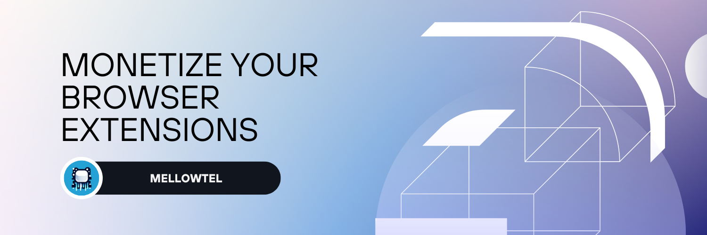

<strong>Mellowtel</strong>

Monetize your Browser plugin. Open-Source, Consensual, Transparent.

 

<a href="https://www.mellowtel.com/">Website</a>
 · 
<a href="https://github.com/mellowtel-inc/mellowtel-js">GitHub</a>
 · 
<a href="https://discord.gg/GC8vwpDWC9">Discord</a>
 · 
<a href="https://docs.mellowtel.com/get-started/quickstart">Documentation</a>

 

---

# Introduction ℹ️

With Mellowtel's Open-Source library, your users can decide if they want to support you by sharing a fraction of their unused internet bandwidth. Trusted partners — from startups to non-profits — access the internet to retrieve publicly available data, and you get paid for it.
Mellowtel is supported on all major browsers: Chrome, Firefox and Edge.

**How?**

Companies need to retrieve publicly available data from the web. You get a share of the revenue they pay for providing access to the web thanks to users that want to support you and share their unused bandwidth.

# Key Features 🎯

- **Easy to use**: Earn from your Browser plugins with a few lines of code.
- **Open-source**: The code is open-source and available for everyone to see.
- **Consensual & Opt-out by default**: Users are opted out by default. If they want to support you they have to explicitly opt-in. They can opt-out and manage their settings at any time.
- **Non-intrusive & Private**: In contrast to ads network, we do not collect, share, or sell personal information (not even anonymized data). The whole business model relies on the fact we don't need to collect or sell data but on using a small portion of unused bandwidth
- **Good user experience**: Mellowtel only requires enough resources to open an additional incognito tab. In order to guarantee a good user experience we only operate when the connection is stable (wifi, ethernet) and there is high bandwidth available.

# Why❓

We believe that extension developers should be able to earn from their hard work without compromising their users' privacy or experience. Most Browser plugins provide a lot of value to users, but they are not willing to pay for them.

Mellowtel gives your users a way to support your extension without having to directly pay for it. They can instead choose to share a fraction of their unused internet bandwidth. It's a win-win situation for everyone: users pay with a resource they aren't using, and you get paid for your work.

Hopefully this will lead to fewer extensions being shut down or discontinued due to inability to monetize, fewer personal data being collected and sold, and more transparency in the Browser plugins ecosystem.

See other "monetization solutions" below for examples of what can go wrong when developers are not given a fair way to earn from their work.

# What are the current "monetization solutions"? 🧐

We have been developing Browser plugins and trying to monetize them for years. We, too, received a hefty amount of the "monetization solutions" emails.

Well, honestly, most attempts to monetize Browser plugins are just shady at best and total scams at worst. They either buy your extension or provide SDKs that collect and sell your users' personal data (credit card information, addresses), spoof their passwords, inject unwanted ads into your extension, inject affiliate links, etc.

A recommended read: [Temptations of an open-source browser extension developer](https://github.com/extesy/hoverzoom/discussions/670)

And a highlight from the article 😰:

> "...we provide several methods of monetizating- from the soft to the hard methods."

# Getting started 🚀

We have moved our documentation to a dedicated website: [docs.mellowtel.com](https://docs.mellowtel.com).

# Quickstart

[Here](https://docs.mellowtel.com/browser-plugins/quickstart) is a detailed guide on how to get started with Mellowtel.

# Contributing 🫶

Mellowtel is an open-source project, and contributions are welcome. If you want to contribute, you can create new features, fix bugs, or improve the infrastructure. Please refer to the [CONTRIBUTING.md](https://github.com/mellowtel-inc/mellowtel-js/blob/main/CONTRIBUTING.md) file in the repository for more information on how to contribute.

To see how to contribute, visit [Contribution guidelines](https://github.com/mellowtel-inc/mellowtel-js/blob/main/CONTRIBUTING.md)

# Support

You can reach out to us on [Discord](https://discord.gg/GC8vwpDWC9) if you have any questions or need help.

# License 📜

GNU Lesser General Public License v3.0

[License](https://github.com/mellowtel-inc/mellowtel-js/blob/main/LICENSE.MD)
